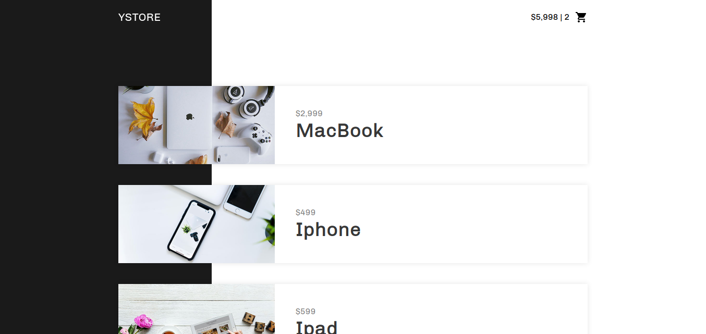

# YSTORE

YSTORE it's a frontend application for an e-commerce focused in marketing of
Apple products. This project its's a exercise of the Vue.js online course taught
by *[Origamid](https://origamid.com)*.

### Screenshoot

### Used Features
- [x] Vue watch
- [x] Vue hooks
- [x] Vue computed properies
- [x] Vue directives
- [x] CSS Animations
- [x] LocalStorage API
- [x] Fetch API
- [x] History API
